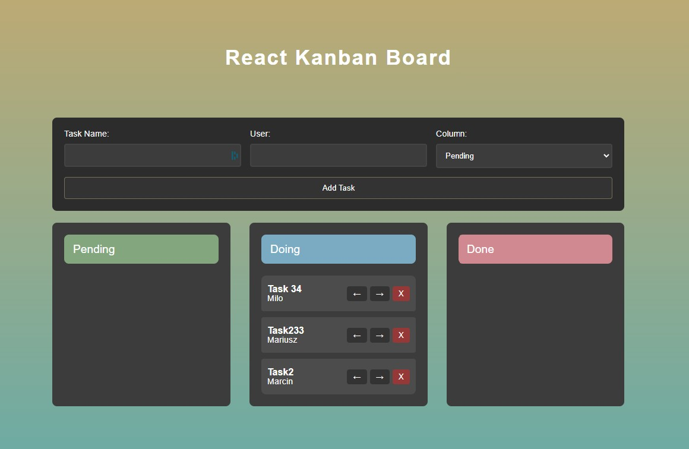

# React Kanban Board

This repository is dedicated to practicing and showcasing modern frontend skills using React by building a Kanban board application.

## 🚀 Live Demo

[](https://marazmlab.github.io/React-Kanban-Board/)

&nbsp;

**Main features:**
- Manage tasks in columns (Pending, Doing, Done) with limits per column.
- Add, move, and delete tasks with instant UI updates.
- Persist board state in localStorage.
- Responsive and modern UI, ready for portfolio presentation.

&nbsp;

## 🔶 Technologies


&nbsp;


## 🔶 Tasks Overview

- **Task List:** Displays tasks in three columns (Pending, Doing, Done).
- **Add Task:** Users can add new tasks with a name and user assignment.
- **Move Task:** Tasks can be moved between columns (with respect to column limits).
- **Delete Task:** Remove tasks from any column.
- **Persistence:** All changes are saved in localStorage.
- **Responsive Design:** Works on desktop and mobile devices.

&nbsp;

## 🔶 Solutions provided in the project

### Example: Moving a Task Between Columns

```jsx
// In Task.js
<button
  className="task__button"
  onClick={() => moveTask(id, columnId, columnId + 1)}
  disabled={columnId === 3}
>
  →
</button>
```
This example showcases:
- **Column limits:** Prevents moving a task if the target column is full.
- **State update:** Moves the task and updates the board instantly.
- **User feedback:** Disables the button when moving is not possible.

&nbsp;

## 🔶 Conclusions

- **State management:** Context API and useState provide simple and scalable state handling.
- **Component structure:** The project demonstrates modular and reusable React components.
- **Styling:** CSS modules and media queries ensure a modern, responsive look.
- **Persistence:** The board state is always saved, even after page reloads.

This project is a great showcase for modern React and frontend skills.

&nbsp;

## 🔶 Feel free to contact me

If you have any questions or feedback, feel free to reach out!  
Find me on [GitHub](https://github.com/marazmlab) or [LinkedIn](https://www.linkedin.com/in/belz/).

&nbsp;

## 🔶 Thanks / Special thanks / Credits

Thanks to my [Mentor - devmentor.pl](https://devmentor.pl/) – for providing me with this task and for code review.
